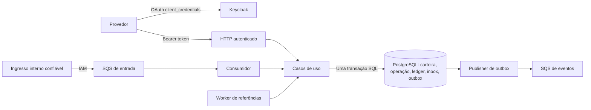
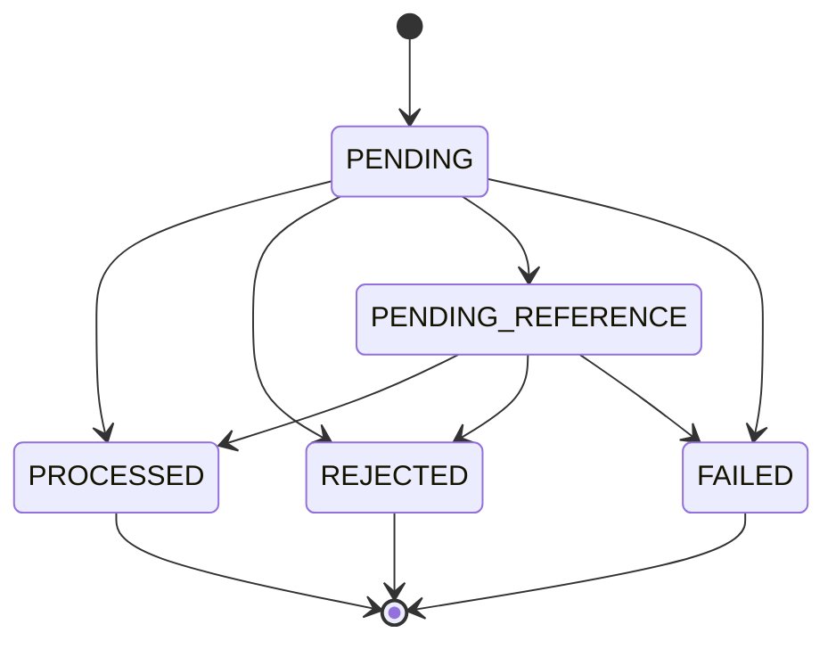

# Decisões de arquitetura

A unidade de consistência é a carteira no PostgreSQL. Uma operação financeira
só é confirmada quando transação, saldo, ledger e eventos correspondentes podem
ser confirmados juntos. HTTP e SQS diferem em autenticação e confirmação de
entrega, mas compartilham as regras, a identidade da operação e a transação SQL.

## Organização e fluxo



| Pacote | Responsabilidade |
| --- | --- |
| `internal/domain` | Dinheiro, carteira, transação, ledger e eventos; sem I/O ou Fx |
| `internal/application` | Casos de uso, hash e interfaces `Repository`/`UnitOfWork` |
| `internal/postgres` | SQL explícito, mapeamento, transações, consultas e migrations |
| `internal/auth` | Verificação de tokens e identidade autenticada |
| `internal/httpapi` | Contrato HTTP, autorização, parsing e respostas |
| `internal/messaging` | Cliente SQS, inbox, workers de referências/outbox e ciclo de entrega |
| `internal/observability` | Registro de métricas com cardinalidade limitada |
| `internal/bootstrap` | Composição Fx, recursos e ciclo de vida |
| `cmd/` | Entrada da aplicação e executável de migration |

`pgx/v5` foi escolhido para manter visíveis os locks, as constraints e os limites
de cada commit. Não há ORM, transação distribuída, cache financeiro nem lock de
processo. `Repository.Within` cria uma transação `pgx.Tx` e passa a mesma
`UnitOfWork` a todos os repositórios envolvidos. Erro no callback ou no commit
aborta o conjunto. Cada chamada de I/O recebe contexto.

## Bibliotecas para funções padronizadas

Funções de infraestrutura usam bibliotecas mantidas e conhecidas. O código da
aplicação concentra as políticas do desafio e a ligação entre esses componentes.

| Função | Biblioteca | Responsabilidade delegada |
| --- | --- | --- |
| Identificadores | `github.com/google/uuid` | Geração de UUID v4 e validação do formato |
| Configuração | `github.com/caarlos0/env/v11` | Parsing tipado de variáveis e valores padrão |
| Métricas | `github.com/prometheus/client_golang` | Collectors, concorrência e exposição HTTP via `promhttp` |
| Evolução do banco | `github.com/golang-migrate/migrate/v4` | Descoberta de arquivos, versões, dirty state e lock de deployment |
| Chaves do IdP | `github.com/go-jose/go-jose/v4` | Decodificação e validação das JWKs |
| Status e duração HTTP | `github.com/felixge/httpsnoop` | Instrumentação preservando as interfaces do `ResponseWriter` |

OIDC, SQS, acesso ao banco e composição continuam usando `go-oidc`, AWS SDK v2,
`pgx` e Fx. A biblioteca padrão atende HTTP, logs JSON, serialização, SHA-256,
base64 e comparação de valores. O domínio mantém centavos em `int64`, validações
de escala/moeda e limites aritméticos, como exigido pelo contrato financeiro.

UUIDs gerados são v4 em formato canônico. A API recebe somente a representação
hifenizada de 36 caracteres; essa restrição é aplicada antes de `uuid.Validate`,
que também aceita outras representações em seu contrato geral.

O atraso calculado a partir de uma tentativa persistida continua uma política
determinística do serviço. A continuidade do trabalho pertence ao PostgreSQL;
retries de transporte pertencem ao SDK AWS. Essa separação preserva o resultado
em reentregas e reinícios.

## Migrations e atualização de instalações existentes

O executável `cmd/migrate` usa `golang-migrate` com os arquivos SQL embarcados
pelo source `iofs` e o driver `pgx/v5`. Arquivos seguintes seguem a convenção
`002_nome.up.sql` / `002_nome.down.sql`; `up` aplica as versões pendentes e `down`
reverte todas as versões. Uma execução sem trabalho pendente é bem-sucedida.

Cada arquivo é enviado inteiro ao PostgreSQL, com o modo multi-statement do
driver desativado. O protocolo executa o conjunto numa transação implícita. As
migrations devem manter essa propriedade: não introduzir `BEGIN`/`COMMIT`
internos ou DDL não transacional sem rever a garantia e seus testes.

A primeira execução após a troca da ferramenta reconhece o formato anterior de
`schema_migrations`: converte `version` para `bigint` e acrescenta `dirty=false`,
preservando a versão `1` já aplicada e `applied_at`. Não reaplica o schema
financeiro nem modifica carteiras ou ledger. Versões legadas desconhecidas são
recusadas para inspeção; não são consideradas aplicadas por suposição.

O engine marca uma versão como `dirty` antes da execução e limpa essa marca ao
terminar. Se houver falha ou confirmação ambígua, execuções seguintes param até
uma inspeção operacional. Não existe `force` automático. É necessário verificar
logs, SQL e estado real do schema antes de ajustar a versão com a CLI oficial;
`force` altera somente os metadados e não executa nem desfaz comandos SQL.

O engine não recebe `context.Context` em suas operações. Por isso a adaptação
abre uma conexão exclusiva, usando a configuração do pool, e interrompe seu
socket no cancelamento. A conexão pertence à migração; o pool recebido continua
aberto. Essa ligação também cobre espera por advisory lock e cleanup de timeout.

## Dinheiro e agregados

`Money` possui campos privados: `minor int64` e moeda. A persistência usa
`BIGINT` em unidades mínimas e uma coluna de moeda; o contrato externo usa
`{"amount":"25.00","currency":"BRL"}`. BRL, USD e EUR são aceitas, todas com
duas casas; não existe conversão cambial.

O intervalo interno é de `-92233720368547758.08` a `92233720368547758.07`.
Entradas externas e saldos são não negativos, portanto seu máximo é
`92233720368547758.07`. Parsing, soma, subtração e negação verificam overflow;
a negação de `MinInt64` é inválida. Subtração verifica limites diretamente,
permitindo `MinInt64 - MinInt64 = 0`. Comparação e aritmética exigem a mesma
moeda. Não se usa ponto flutuante para valores monetários em nenhuma etapa.

O parsing aceita `25`, `25.0`, `25.00` e zeros à esquerda; serializa todos como
`25.00`. Rejeita sinal, espaços, vazio, `NaN`, `Infinity`, expoentes, vírgula,
mais de duas casas e números JSON. Não há arredondamento. Valores negativos
existem somente em cálculos internos e respostas como a diferença de
reconciliação. O zero padrão de Go não é um `Money` válido; `Zero(currency)`
cria um zero com moeda explícita.

`Wallet` controla débito, crédito, versão e timestamps. A versão começa em `1`
e avança somente quando o saldo muda. `LOSS` e rejeições não alteram saldo ou
versão. Construtores e operações públicas validam invariantes; reidratação
valida o snapshot sem reaplicar movimentos, eventos ou transições. Snapshots e
payloads de eventos são cópias; ponteiros de resultado não expõem estado mutável.
Rejeições de negócio usam erros classificáveis, não `panic`.

Abertura positiva cria a carteira na versão `1`, uma operação interna
`OPENING`, um crédito partindo de zero e os eventos de processamento e saldo,
no mesmo commit. `OPENING` tem ID interno estável e não recebe provedor, rodada,
chave, hash ou ID externo. Abertura com zero não cria esses registros
financeiros. O schema impede segunda carteira por jogador/moeda e segundo
`OPENING` por carteira.

## Idempotência persistente

Existem duas identidades externas complementares:

- `(providerId, idempotencyKey)` fixa o significado da chave recebida;
- `(providerId, externalTransactionId)` fixa a operação financeira, inclusive
  quando o cliente tenta reenviá-la com outra chave.

A tabela `idempotency_keys` preserva aliases: outra chave com o mesmo ID externo
e conteúdo é vinculada à operação existente e retorna replay. Reutilizar
qualquer chave vinculada com outro conteúdo produz `409`. Nenhuma chave é
silenciosamente substituída por uma calculada pelo servidor.

O hash é SHA-256, em hexadecimal minúsculo, de um objeto JSON com estes campos:

```text
externalTransactionId, gameId, kind, money, playerId, providerId,
referenceExternalTransactionId, roundId, walletId
```

`encoding/json` ordena as chaves do mapa; `money` tem os campos `amount` e
`currency` nesta ordem, com representação decimal normalizada. A referência
omitida vira string vazia e participa do hash. Chave de idempotência, headers,
correlation ID, message ID e data de entrega não entram nesse hash.
Os UUIDs de `playerId` e `walletId` são normalizados para minúsculas antes
dos hashes de negócio e inbox. IDs externos, provedor, rodada e jogo continuam
sensíveis a maiúsculas/minúsculas; não há remoção silenciosa de espaços.
A moeda exige um código suportado em maiúsculas. Trata-se
de uma canonicalização definida para este contrato fixo, não de uma biblioteca
universal de canonicalização de JSON.

O resultado terminal persiste `status`, `failureCode` quando aplicável,
`result_balance` e `result_currency`. Replay devolve esse snapshot; não lê o
saldo atual para reconstruir a resposta. Uma aposta rejeitada por saldo
insuficiente continua rejeitada depois de um crédito posterior. Uma chave
conflitante também não pode ser utilizada para consultar dados de outro
provedor: autorização e filtro de provedor acontecem antes da resposta.

Formato inválido é recusado antes do aceite. Uma operação válida que viole regra
financeira é persistida como rejeição. Erros de infraestrutura não são
convertidos em rejeição de negócio; um cliente que recebe timeout ou `503`
repete a mesma operação com a mesma chave, inclusive se não souber se o commit
anterior aconteceu.

## Transação SQL e concorrência

O fluxo de uma operação nova é:

1. Em SQS, inserir/reivindicar a inbox e bloquear sua identidade.
2. Adquirir advisory locks transacionais para chave e ID externo, no namespace
   do provedor, e procurar uma operação já registrada.
3. Para operação nova, bloquear a linha da carteira com `SELECT FOR UPDATE`
   **antes** de inserir a transação que a referencia.
4. Avaliar domínio e referência; persistir processamento, rejeição ou pendência.
5. Se houver movimento, atualizar carteira e inserir ledger. Inserir os eventos
   correspondentes na outbox; concluir a inbox quando houver.
6. Confirmar o conjunto; somente depois responder ou remover a mensagem SQS.

Bloquear a carteira antes da inserção evita uma inversão com os locks de chave
estrangeira. Os advisory locks coordenam identidades; o lock de linha coordena
o saldo. Nenhum deles é global ao tráfego. Colisões do hash do advisory lock
podem serializar identidades diferentes, sem alterar o significado delas; as
constraints continuam sendo a autoridade sobre unicidade.

O isolamento padrão é `READ COMMITTED`. Depois de obter o lock da carteira,
a instância trabalha com o estado confirmado mais recente; escritores dessa
carteira ficam serializados até commit/rollback. Carteiras diferentes usam
linhas diferentes. Duas apostas de `80.00` sobre `100.00` resultam em uma
aprovação e uma rejeição: a segunda instância observa `20.00`. Atualizações
não dependem de cópias de saldo mantidas em memória.

Cada processo usa um pool de até 12 conexões. A configuração adiciona connect
timeout de 5 segundos, statement timeout de 10 segundos, lock timeout de
5 segundos e idle-in-transaction timeout de 15 segundos. Deadlock, disputa que
ultrapasse timeout e desconexão não autorizam um débito parcial: há rollback e
retry com a identidade original. Não existe loop ilimitado de retry dentro da
requisição HTTP; o consumidor e os workers fazem novas tentativas duráveis.
Os locks de deployment das migrations coordenam somente evolução de schema, fora do caminho
financeiro.

## Proteções no banco e ledger

As migrations tornam as principais invariantes verificáveis sem confiar
apenas no código Go:

- Saldo não negativo; moeda suportada; versão positiva; uma carteira por
  jogador/moeda; uma operação por identidade externa e chave original.
- Unicidade de `(walletId, transactionId)` e `(walletId, walletVersion)` no
  ledger; arithmetic check de saldo anterior, direção, valor e saldo posterior.
- Triggers proíbem `UPDATE`/`DELETE` do ledger e mutação de operações terminais,
  identidades, aliases, conclusões de inbox e snapshots da outbox.
- Um índice parcial permite uma única reversão processada por referência,
  compartilhada entre `REFUND` e `ROLLBACK`.
- Constraint triggers adiadas até o commit comparam saldo/versão com o ledger,
  exigem lançamento para operação processada com movimento, proíbem lançamento
  de `LOSS`/rejeição e validam sequência, moeda, valor e referências de reversão.

Os checks monetários SQL usam `numeric` quando a soma intermediária poderia
exceder `BIGINT`, sem perder exatidão. O ledger é uma trilha de saldo, não um
ledger de partidas dobradas. Correções financeiras são novos lançamentos.

O usuário runtime `wager` não é owner nem superuser. Pode consultar os registros,
inserir onde necessário, atualizar carteira/transação/inbox e somente as colunas
de entrega da outbox. Não recebe DDL, `DELETE`, `TRUNCATE` ou edição do ledger.
O owner `wager_owner` é reservado às migrations/testes; em produção, a role de
execução não deve receber essa credencial nem permissão para desabilitar triggers.
Administradores do banco pertencem à fronteira de confiança.

A verificação adiada percorre os registros da carteira, podendo executar mais
de uma vez por transação SQL. Esse custo cresce com seu histórico; privilegia
uma evidência forte de consistência para o desafio. Antes de alto volume, seria
necessário medir e substituir a varredura por checks incrementais equivalentes,
manter a auditoria independente e repetir os testes de corrupção/concorrência.
Não há promessa de throughput nem benchmark de carga nesta entrega.

## Estados, referências e reversões



`PENDING` é o estado inicial do domínio. Operações sem dependência são concluídas
na mesma transação SQL de seu aceite; não há commit intermediário para deixar
trabalho sem dono. O scanner também procura `PENDING` durável, além de
`PENDING_REFERENCE`, permitindo retomar registros não terminais.

Referências são resolvidas por `(providerId, referenceExternalTransactionId)`.
Se ainda não existem ou estão `PENDING`/`PENDING_REFERENCE`, a operação fica
`PENDING_REFERENCE`. A primeira espera emite um único
`WagerTransactionPendingReference`; tentativas posteriores atualizam apenas
o agendamento. Se a referência terminou rejeitada ou falhou, o resultado é
`REFERENCE_NOT_PROCESSED`, sem aguardar até o TTL.

A pendência persiste contador, próximo horário e deadline. Cada varredura lê
até 100 IDs elegíveis e processa cada um em sua transação. Os locks da operação
e da carteira usam `FOR UPDATE SKIP LOCKED`; uma carteira ocupada é pulada
para permitir o avanço das demais. O worker revalida estado e horário ao
reivindicar a operação. Várias instâncias podem selecionar o mesmo ID, mas
apenas uma efetua a transição. O mecanismo é lock transacional com revalidação,
sem lease em memória.

O backoff de referências é `1, 2, 4, 8, ...` segundos, limitado a 256 segundos.
A primeira espera consome uma tentativa. O padrão permite oito esperas; o worker
rejeita ao reencontrar o registro após esgotar o limite ou o TTL de 24 horas,
o que ocorrer primeiro. Assim, com o serviço continuamente disponível, as oito
esperas padrão podem esgotar o limite em cerca de 255 segundos; TTL não significa
aguardar necessariamente 24 horas. A rejeição usa `REFERENCE_NOT_FOUND` e gera
evento. O vencimento é observado na próxima passagem do worker, não por um
timer por transação; o estado sobrevive ao reinício de todos os processos.

`REFUND` devolve integralmente uma `BET`. `ROLLBACK` credita quando referencia
`BET`, e debita quando referencia `WIN` ou `REFUND`. Referência e operação devem
concordar em provedor, jogador, carteira, moeda e rodada; uma reversão deve ter
o mesmo valor. `WIN` pode referenciar `BET` da mesma rodada, sem exigir que seu
valor seja igual ao da aposta. Não há reversão parcial.

A política de reversão é conservadora: uma aposta pode receber **um** `REFUND`
ou **um** `ROLLBACK`, nunca ambos. Um `ROLLBACK` de `REFUND` é permitido, desde
que haja saldo para o débito, mas não libera a aposta original para uma segunda
devolução. Isso mantém a regra auditável sem reconstruir cadeias arbitrárias.
Um rollback que não consegue debitar recebe `REVERSAL_INSUFFICIENT_FUNDS`,
diferente de `INSUFFICIENT_FUNDS` de uma aposta.

`FAILED` é validado pelo domínio/schema como terminal e aparece no diagrama
como capacidade de modelagem. O fluxo operacional atual **não promove erros
genéricos de infraestrutura a `FAILED`**: não é seguro inferir permanência de
um timeout, banco indisponível ou resposta ambígua do broker. Esses erros usam
retry/`503`; mensagens irrecuperáveis conservam seus bytes na DLQ. Não existe
hoje uma rotina administrativa que registre `FAILED` para uma operação após
diagnóstico humano. Essa parte não deve ser confundida com a rejeição financeira,
que é persistida e auditável.

## Inbox e processamento SQS

O envelope `WagerTransactionRequested` contém `messageId`, `type`, `occurredAt`
e `data`, incluindo `idempotencyKey`. O consumidor usa a identidade do envelope,
sem depender do ID atribuído pelo SQS. A inbox tem chave
`(consumer_name = 'wager-transactions', message_id)` e hash SHA-256 do envelope
normalizado completo, incluindo chave e timestamp. Ordem/espaçamento do JSON
não definem a identidade; mudar conteúdo, chave ou instante para o mesmo
`messageId` gera conflito.

A deduplicação da inbox é adicional à identidade financeira: duas mensagens
com IDs diferentes, ou uma combinação de HTTP e SQS, ainda chegam ao mesmo
registro de negócio. Se a inbox já foi concluída, a transação persistida é
consultada e nenhum lançamento novo é criado. Claim, conclusão, domínio,
ledger e outbox compartilham o commit.

Uma referência pendente pode concluir a inbox porque a responsabilidade de
continuação já foi registrada no PostgreSQL. Rejeições de negócio também
concluem o tratamento. Só depois desse commit o consumidor chama `DeleteMessage`.
Se cair entre os dois passos, a reentrega encontra a inbox concluída. Se cair
antes do commit, o rollback e o fim do visibility timeout permitem nova execução.

O consumidor busca uma mensagem por vez por processo. `MessageGroupId` deve
ser o ID da carteira; `MessageDeduplicationId` deve identificar a entrega.
Deduplicação FIFO ajuda no transporte, mas não é a garantia financeira. Os
testes enviam deduplication IDs diferentes para provocar entregas reais repetidas.

Na configuração local, cinco recebimentos sem conclusão levam à DLQ. Falhas
de processamento alteram a visibilidade com backoff `1, 2, 4, ...`, limitado
a 64 segundos. Falhas de polling aguardam um segundo antes de tentar novamente.
Envelope inválido, conflito de inbox e falha de infraestrutura não são removidos
silenciosamente. Mensagens maiores que 256 KiB e campos desconhecidos são
recusados pelo consumidor. Não há descarte automático da DLQ ou replay
administrativo que ignore validações; correções devem manter a identidade
financeira e tratar cuidadosamente a identidade de entrega.

## Outbox, entrega e ordem de eventos

Os construtores de domínio definem tipo e `version: 1`. O envelope contém
`eventId`, `eventType`, `aggregateId` (carteira), `correlationId`, `causationId`
opcional, `occurredAt` UTC em RFC 3339 e `data` concreto. O payload serializado
é um snapshot imutável em `JSONB`; scheduling não reconstitui eventos a partir
do saldo atual.

| Evento | Conteúdo e ocasião |
| --- | --- |
| `WagerTransactionProcessed` | Operação e resultado terminal, inclusive `LOSS` e `OPENING` |
| `WagerTransactionRejected` | Identidade da operação, código estável e saldo observado |
| `WagerTransactionPendingReference` | Operação e referência aguardada; apenas na primeira espera |
| `WalletBalanceChanged` | `walletId`, `transactionId`, `direction`, `money`, `balanceBefore`, `balanceAfter`, `walletVersion` |

Os eventos internos de abertura omitem metadados externos inaplicáveis. `LOSS`
emite somente evento de processamento. Falhas de formato recusadas antes de
aceite não fabricam eventos financeiros.

Cada publisher começa outra transação SQL e seleciona um evento vencido com
`FOR UPDATE SKIP LOCKED`. Mantém o lock durante um envio limitado por timeout,
registra tentativas e `published_at` e confirma. Outro publisher pode avançar
com outra linha; encerramento do processo libera o lock sem um mecanismo extra
de expiração de lease. O publisher nunca usa a transação da movimentação para
fazer I/O externo.

Se o envio falha, o evento continua pendente e recebe `next_attempt_at` com
backoff de 1 a 64 segundos. A tentativa de persistir o retry tem prazo próprio
de dois segundos; se também falhar, a linha continua recuperável. Não há limite
que descarte um evento confirmado da outbox. Indisponibilidade prolongada exige
monitorar atraso e capacidade de armazenamento.

Se o envio funcionou e o processo caiu antes de confirmar `published_at`, outra
instância envia o mesmo `eventId` e mesmo payload. O deduplication ID SQS de
saída é o `eventId`, e o group ID é a carteira. A janela de deduplicação FIFO
não substitui a deduplicação durável dos consumidores: a entrega externa é
**at-least-once**, com efeito financeiro único no produtor.

A fila `wager-events.fifo` recebe todos os tipos; o consumidor roteia por
`eventType` e `version`. Uma fila possui consumidores concorrentes, não fan-out
independente para vários serviços. Adicionar assinaturas independentes requer
outro desenho de distribuição. Publishers podem enviar eventos de uma carteira
em ordem diferente da criação, pois `SKIP LOCKED` permite ultrapassar outra
linha bloqueada. Consumidores não devem inferir ordem financeira apenas pela
chegada: `walletVersion` permite detectar gaps/reordenação dos eventos de saldo.

O trade-off do lock durante I/O é consumir uma conexão enquanto o broker
responde. O envio é limitado, simples de recuperar e não bloqueia commits
financeiros de outras linhas; sob alto volume, uma estratégia de leases/lotes
poderia reduzir custo, mas exigiria protocolos e testes adicionais.

## Autenticação, autorização e broker

Keycloak é o emissor OAuth/OIDC; a aplicação não cria tokens nem armazena senhas
de usuários. `client_credentials` atende à comunicação serviço/provedor. O
verificador usa `go-oidc`, aceita RS256 e valida assinatura, issuer exato,
audiência, expiração, subject e `nbf`. O `nbf` é verificado sem tolerância extra;
os relógios precisam estar sincronizados. O cache de chaves e sua atualização
são responsabilidade do `RemoteKeySet`.

O issuer público local é `http://localhost:8081/realms/jungle`; a URL interna
de JWKS pode ser `http://keycloak:8080/.../certs`. Separar esses endereços resolve
o acesso entre host e Docker sem desligar a validação de issuer/audiência.
O IdP configura `provider_id` como claim fixo no cliente; não é derivado da
chave enviada nem de um atributo livre do corpo.

`wallet:internal` é exigido para abertura, saldo, ledger e reconciliação.
`wager:provider` é exigido para envio e consulta de transações. O provedor do
corpo/path deve corresponder ao claim autenticado. Consultas por ID interno
sempre filtram por provedor e retornam `404` quando o registro pertence a outro;
um path que pede explicitamente outro provedor recebe `403`. Replays obedecem
a mesma autorização. Health e métricas são as exceções públicas.

SQS tem outra fronteira: somente um **serviço interno de ingresso confiável**
recebe a identidade `wager-ingress`. Ele deve autenticar o provedor e derivar
sua identidade antes de enviar. Provedores externos usam HTTP; compartilhar a
credencial de ingresso com eles permitiria falsificar `data.providerId`.
Validar regras no consumidor não substitui esse controle de origem.

O provisionamento cria identidades e políticas distintas para ingresso,
aplicação e consumidor de eventos, com ações restritas aos ARNs necessários.
O contêiner da aplicação consegue ler somente seu arquivo de credenciais.
As políticas de filas também declaram os emissores/leitores previstos.
Na AWS, prefira roles da plataforma e credenciais temporárias; o SDK usa a
cadeia padrão de credenciais quando não recebe as variáveis locais.

O LocalStack Community usado no Compose provisiona IAM, mas não reproduz a
imposição de políticas da AWS. A autorização efetiva do broker deve ser
homologada em SQS real ou em uma edição com IAM enforcement. A integração local
prova processamento/recuperação e a configuração declarada, não prova negação
de acesso IAM em produção. Os testes usam credenciais administrativas locais
para criar/remover suas filas isoladas; a aplicação normal do Compose usa sua
identidade restrita.

## Fx, inicialização e encerramento

A composição usa `fx.Module`, construtores em `fx.Provide` e registros de ciclo
de vida em `fx.Invoke`. Domínio e aplicação não importam Fx. A inicialização
valida configuração, conexão PostgreSQL, existência/acesso às três filas e
chaves do IdP antes de concluir a disponibilização do servidor.

No início do encerramento, o hook HTTP interrompe também o polling dos workers.
O servidor para de aceitar conexões e aguarda as requisições, enquanto as
mensagens já recebidas terminam. O hook dos workers aguarda suas goroutines;
por último o pool é fechado.
Os workers separam contexto de polling e contexto de processamento: cancelar
o polling não cancela imediatamente uma operação já em execução. Seus logs
registram início e término.

Dentro do prazo configurado, uma mensagem em andamento termina e é confirmada.
Se o prazo acaba, seu processamento é cancelado e a visibilidade é liberada
quando possível; se a liberação falhar, o timeout do broker permite reentrega.
Outbox/pending liberam seus locks com rollback ou perda da conexão. `SIGKILL`
não executa hooks, mas as garantias de recuperação persistem. O prazo padrão
de shutdown é 20 segundos; o Compose concede 30 segundos antes de forçar a
parada. O teste da composição usa `fx.ValidateApp`; a integração executa início
e término reais dos processos e exige encerramento dentro do prazo.

## Consulta, reconciliação e observabilidade

O ledger usa cursor Base64 URL-safe com carteira, timestamp e ID, ordenando por
`(created_at, id)` e buscando uma entrada extra para detectar próxima página.
O cursor deve ser tratado como opaco; não é uma autorização e não substitui a
permissão interna exigida na rota. As páginas não formam um snapshot congelado
entre requisições; novas entradas podem aparecer enquanto se navega.

A reconciliação é uma única consulta SQL que agrega créditos menos débitos e
lê o saldo da carteira no mesmo snapshot MVCC. Inclui `OPENING`, aceita ledger
vazio de abertura zero e não corrige dados. A soma usa `numeric`, depois valida
se cabe em `int64`; a diferença é saldo armazenado menos saldo reconstruído.
Divergência gera resposta, log e métrica. Uma corrupção cujo total exceda o
intervalo representável gera erro em vez de cálculo com overflow.

Logs JSON registram IDs e resultados, sem tokens ou payload financeiro completo.
O HTTP aceita um correlation ID válido ou cria um; SQS usa o `messageId` como
correlation/causation ID. O publisher registra `eventId` e `aggregateId`, que
permitem voltar ao snapshot persistido.

`/metrics` apresenta contadores por resultado/replay/retry/conflito,
`wager_storage_failures_total`, `wager_concurrency_conflicts_total`,
`wager_outbox_published_total`, `wager_reconciliation_divergences_total`, os gauges
`wager_outbox_oldest_pending_seconds` e `wager_dlq_messages`, e o histograma
`wager_processing_seconds`. Os gauges são atualizados a cada cinco segundos;
a quantidade de DLQ é aproximada, como no SQS. Labels não incluem IDs livres
de provedores ou operações. Contadores são locais ao processo e devem ser
coletados por instância; resultados contam atendimentos, inclusive replays,
e não constituem o livro contábil. O worker de referências também observa
os resultados depois do commit, por callback configurado na composição, sem
introduzir dependência de métricas no domínio.

Os collectors são `Counter`, `CounterVec`, `Gauge` e `Histogram` do cliente
oficial Prometheus, com um registry próprio por instância e exposição via
`promhttp.HandlerFor`. Contadores, sincronização e serialização não são
implementados manualmente. Os valores `float64` exigidos por essa API representam
somente telemetria, como duração em segundos; nenhum valor monetário passa por ela.

Liveness mede o processo; readiness testa PostgreSQL e SQS. Chaves do IdP são
validadas no startup, mas não em cada readiness. Um IdP temporariamente fora
do ar pode permitir tokens cujas chaves estejam em cache e impedir tokens que
exijam refresh. Não há tracing OpenTelemetry ou dashboards nesta entrega.

## Verificação e limites de escopo

Os comandos completos estão no README. Testes de domínio verificam dinheiro,
limites e invariantes; testes HTTP/OIDC verificam contrato e claims. A integração
usa PostgreSQL, Keycloak e LocalStack reais e executáveis Go com `-race`, com
três processos independentes. Os cenários cobrem concorrência financeira,
replay histórico, HTTP/SQS, pendências, isolamento e interrupções nos pontos
críticos de confirmação. A suíte cria bancos/filas isolados e não deve depender
de limpar as carteiras do ambiente normal.

Pontos deliberadamente fora do escopo: ledger de partidas dobradas, conversão
de moedas, liquidação externa, fan-out de eventos, interface administrativa
para DLQ/`FAILED`, política de retenção/arquivamento de inbox/outbox/ledger,
tracing, dashboard e metas de carga. A política de reversão conservadora e o
custo das constraints estão descritos acima para permitir avaliação explícita.

O Compose é ambiente de desenvolvimento: segredos conhecidos, HTTP local,
Keycloak `start-dev`, owner com `CREATEDB` para testes e broker sem enforcement
IAM completo. PostgreSQL usa volume persistente; recriar o LocalStack perde suas
mensagens, inclusive eventos já marcados publicados. A outbox conserva eventos
pendentes, mas não reconstrói automaticamente um broker apagado. Apagar o volume
do PostgreSQL remove a própria fonte da idempotência e da auditoria.

Para produção seriam necessários TLS, roles/secrets gerenciados, autorização
IAM validada na AWS, backups e recuperação de PostgreSQL, retenção operacional,
alarmes e capacidade dimensionada. Nenhuma dessas medidas substitui os testes
das invariantes; são responsabilidades adicionais ao serviço implementado.
